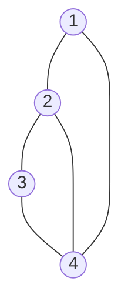

#gate #dm #long #graphs

# Adjacency Matrix

## Definition
An **Adjacency Matrix** represents a graph with $n$ vertices as an $n \times n$ matrix $A$, where each cell $A_{ij}$ indicates whether there is an edge between vertex $i$ and vertex $j$.

For a simple graph with vertex set $V = \{v_1, v_2, \dots, v_n\}$:
$$
A_{ij} = \begin{cases} 
1 & \text{if } (v_i, v_j) \in E \\
0 & \text{otherwise}
\end{cases}
$$

### Example and Diagram

Consider a graph with 4 vertices ($1, 2, 3, 4$) forming a cycle with a chord.

**Graph Diagram:**

**Adjacency Matrix:**

$$
A = \begin{bmatrix}
0 & 1 & 0 & 1 \\
1 & 0 & 1 & 1 \\
0 & 1 & 0 & 1 \\
1 & 1 & 1 & 0
\end{bmatrix}
$$

---

## Properties

- The entries along the principal diagonal of $X$ are all 0's if and only if the graph has **no self-loops**. A self-loop at the $i$-th vertex corresponds to $A_{ii} = 1$.
- The definition of adjacency matrix makes no provision for parallel edges (this matrix representation is typically for **simple graphs**).
- If the graph has no self-loops, then the **degree** of the vertex is the number of 1s in the column or row for that vertex.
    - $\text{deg}(v_i) = \sum_{j=1}^n A_{ij}$

> **Note:** The Adjacency Matrix ordinally depends on how we label the vertices. Relabeling vertices results in a permutation of rows and columns (permutation similarity).

---

## Powers of Adjacency Matrix & Walks

One interesting property of the adjacency matrix concerns its various powers.
The **length of a walk** is the number of occurrences of edges in it.

Let $A^k$ be the $k$-th power of the adjacency matrix $A$.
The entry $(A^k)_{ij}$ equals the **number of walks of length $k$** from vertex $i$ to vertex $j$.

### Example
Let:
$$
A = \begin{bmatrix}
0 & 1 & 0 & 0 \\
1 & 0 & 1 & 1 \\
0 & 1 & 0 & 1 \\
0 & 1 & 1 & 0
\end{bmatrix}
$$

Then $A^2$:
$$
A^2 = \begin{bmatrix}
1 & 0 & 1 & 1 \\
0 & 3 & 1 & 1 \\
1 & 1 & 2 & 1 \\
1 & 1 & 1 & 2
\end{bmatrix}
$$

And $A^3$:
$$
A^3 = \begin{bmatrix}
0 & 3 & 1 & 1 \\
3 & 2 & 4 & 4 \\
1 & 4 & 2 & 3 \\
1 & 4 & 3 & 2
\end{bmatrix}
$$

**Interpretation:**
- $(A^2)_{ij} = x$ means there are $x$ different walks from $i \to j$ of length 2.
- **Principal Diagonal of $A^2$:**
    - A walk of length 2 starting and ending at the same vertex $i$ ($i \to k \to i$) involves going to a neighbor and coming back. 
    - Thus, $(A^2)_{ii} = \text{deg}(v_i)$.
    - Trace of $A^2$ = $2 \times |E|$.

- **Principal Diagonal of $A^3$ and Triangles:**
    - A walk of length 3 starting and ending at $i$ ($i \to j \to k \to i$) corresponds to a triangle involving $i$ (if $i, j, k$ are distinct) or traversing an edge and back (which isn't a simple cycle).
    - For simple graphs, $(A^3)_{ii}$ relates to triangles.
    - Specifically, $\sum (A^3)_{ii} = \text{Trace}(A^3) = 6 \times (\text{Number of Triangles})$.
    - **Why division by 6?**
        - Each triangle $(i, j, k)$ is counted for each vertex ($i, j, k$) -> $3 \times$.
        - The cycle can be traversed in 2 directions ($i \to j \to k \to i$ and $i \to k \to j \to i$) -> $2 \times$.
        - Total counts per triangle = $3 \times 2 = 6$.

---

## Eigenvalues — Intuition (Funzies)

# bit of a tangent, i dont know shit about eigen vectors and values so i had to chatgpt and i was trying to make it explain to me like im 5 years old lmao

### 1. THE ARROW & MACHINE IDEA (INTUITION)

Think of a matrix as a machine.
An arrow means a direction (with some length).

When you put an arrow into the machine:
- Most arrows come out turned (direction changes)
- Some special arrows come out in the **SAME** direction,
  only stretched, shrunk, flipped, or crushed

Those special arrows are called:
→ **Eigenvectors**

How much those arrows stretch or shrink is called:
→ **Eigenvalues**

IMPORTANT:
Eigenvalues do NOT belong to one arrow.
They belong to the machine, discovered by testing different directions.

--------------------------------------------------

### 2. A SIMPLE MATRIX (THE MACHINE)

Consider the matrix:

A = [ 2  2
      1  1 ]

This matrix is the machine.

What it does to an arrow (x, y):
- New x = 2x + 2y
- New y = x + y

--------------------------------------------------

### 3. TRY DIFFERENT ARROWS (ONE AT A TIME)

Arrow 1: (1, 0)  → right direction
A(1, 0) = (2, 1)
Direction changed ❌
Not an eigenvector

Arrow 2: (0, 1)  → up direction
A(0, 1) = (2, 1)
Direction changed ❌
Not an eigenvector

Arrow 3: (1, 1)  → diagonal
A(1, 1) = (4, 2)

(4, 2) is the SAME direction as (1, 1),
just stretched.

So:
- Eigenvector direction = (1, 1)
- Eigenvalue = 2 (stretch factor)

Arrow 4: (1, -1)
A(1, -1) = (0, 0)

Arrow gets completely crushed.
Direction is preserved (just zeroed).

So:
- Eigenvector direction = (1, -1)
- Eigenvalue = 0

--------------------------------------------------

### 4. FINAL RESULT FOR THIS MATRIX

Eigenvalues:
- 2  → stretches the (1, 1) direction
- 0  → crushes the (1, -1) direction

--------------------------------------------------

### 5. KEY TAKEAWAYS (VERY IMPORTANT)

- A matrix can have multiple eigenvalues
- Each eigenvalue corresponds to a special direction
- Eigenvectors are directions that do NOT turn
- Eigenvalues tell how much those directions stretch or shrink

**ONE-LINE SUMMARY:**
Eigenvalues are the special stretch/shrink factors of a matrix along its special directions.

---

## Spectral Properties of Graphs

Let $A$ be the adjacency matrix of a simple graph $X = (V, E)$. Let $\lambda_1, \lambda_2, \dots, \lambda_n$ be the eigenvalues of $A$.

1. $\sum \lambda_i = 0$ (if more than 0 then self loop)
2. $\sum \lambda_i^2 = 2 \times |E(X)|$, where $|E(X)|$ is the number of edges
3. $\sum \lambda_i^3 = 6 \times T(X)$, where $T(X)$ is the number of triangles in the graph.

---

## Adjacency Matrix and Connectivity

Let $X$ be a connected graph on $n$ vertices. If $A$ is its adjacency matrix then every entry of $(I+A)^{n-1}$ is positive.

### Explanation (Generating Functions Analogy)

You can think about this using the idea of generating functions like $\frac{1}{1-x} = 1 + x + x^2 + x^3 \dots$. 
Similarly for matrices, we can relate $(I-A)^{-1}$ to the sum $I + A + A^2 + \dots$.

For the specific case of $(I+A)^{n-1}$, we can expand it using the Binomial Theorem:
$$ (I+A)^{n-1} = I + (n-1)A + \binom{n-1}{2}A^2 + \dots + A^{n-1} $$

Since all coefficients are positive, the result is a weighted sum of powers of adjacency matrices.
- $A^k$ has non-zero entries where there is a walk of length $k$.
- If a graph is connected, between any two vertices there is a path of length at most $n-1$.
- Therefore, the sum will definitely have a non-zero contribution from one of the $A^k$ terms for every pair of vertices.
- Since we are adding Identity $I$, the diagonal is covered.
- Since we are adding $A, A^2 \dots$, all connected paths are covered.
- Thus, every entry in the resulting matrix is positive.

---

## Relevant PYQs

### GATE IT 2005 | Question: 84b
[Discussion Link](https://gateoverflow.in/3857/gate-it-2005-question-84b)

If there is at least a $1$ in each of $A\text{’s}$ rows and columns, then:
1. the graph must be connected.
2. The diagonal entries of $A^{2}$ are the degrees of the vertices of the graph.
3. If the graph is connected, then none of the entries of $A^{n-1} + I_{n}$ can be zero.
(Check original question for full context)

### GATE CSE 2022 | Question: 42
[Discussion Link](https://gateoverflow.in/371894/gate-cse-2022-question-42)

This question involves adjacency matrix properties related to connected components and eigenvalues.
