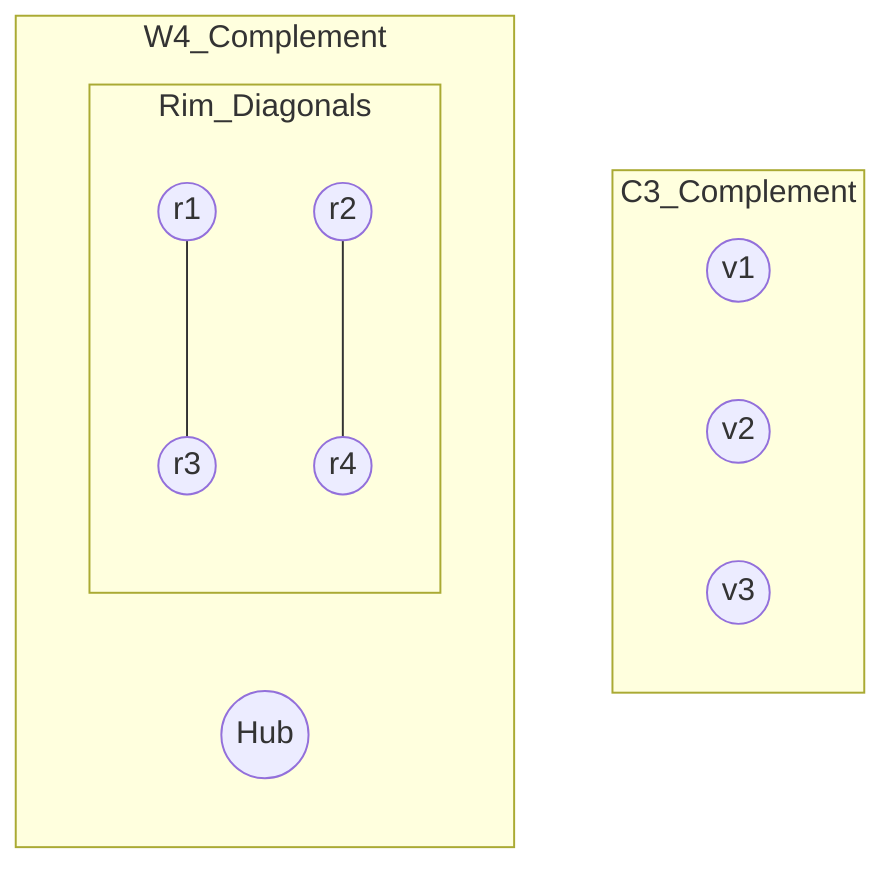

#gate/dm/long/graphs/connectivity

# Graph Theory - Connectivity

**Date:** 29/01/2026

## 1. Basics of Connectivity

### Definitions
1.  **Walk:**
    - An alternating sequence of vertices and edges: $v_0, e_1, v_1, e_2, \dots, v_k$.
    - **Rule:** Vertices and Edges **CAN** be repeated.
    - *Analogy:* Just walking around aimlessly.

2.  **Trail:**
    - A walk with **NO repeated edges**.
    - Vertices CAN be repeated.
    - *Key:* "Trail" sounds like leaving a mark on the path (edge), so you can't walk on it again.

3.  **Path:**
    - A walk with **NO repeated vertices** (and consequently no repeated edges).
    - *Exception:* Start and End vertices can be same (Closed Path / Cycle).

| Type | Repeat Vertices? | Repeat Edges? |
| :--- | :---: | :---: |
| **Walk** | Yes | Yes |
| **Trail** | Yes | **No** |
| **Path** | **No** | **No** |

---

## 2. Connected vs Disconnected Graphs

-   **Connected Graph:** A graph is connected if there is a path between **every pair** of distinct vertices.
-   **Disconnected Graph:** A graph that is not connected. It consists of two or more disjoint connected subgraphs called **Components**.

### Components
-   A **Component** is a maximal connected subgraph.
-   A disconnected graph $G$ is essentially a set of components ($k \ge 2$).

### Connectivity & Complements (Theorems)
Let $G$ be a graph and $\bar{G}$ (or $G'$) be its complement.

-   **Statement 1:** If $G$ is connected, then $\bar{G}$ is connected. -> **FALSE**
    -   *Counter-example:* $C_4$ is connected, $\bar{C_4} = 2K_2$ (disconnected).
-   **Statement 2:** If $G$ is disconnected, then $\bar{G}$ is **always** connected. -> **TRUE**
    -   *Logic:* If $u, v$ are in different components in $G$, they are not connected. Thus, in $\bar{G}$, there MUST be an edge between them. If they are in the same component, they can reach each other via nodes in other components.

### Minimum Degree & Connectivity
-   **Theorem:** If $\delta(G) \ge \frac{n-1}{2}$, then $G$ is **connected**.
    -This ensures enough edges to force overlap between neighborhoods of any two vertices.

-   **Theorem (Odd Degree Pair):** If a graph has **exactly two** vertices of odd degree ($a$ and $b$), then there is **always a path** between $a$ and $b$.
    -   *Consequence:* They must belong to the same component. You cannot have one odd degree node in one component and one in another (Handshaking Lemma violation per component).

---

## 3. Range of Edges

### For a Connected Graph with $n$ vertices:
-   **Min Edges:** $n-1$ (Tree structure).
-   **Max Edges:** $\frac{n(n-1)}{2}$ ($K_n$).
$$ n-1 \le |E| \le \binom{n}{2} $$

### For a Disconnected Graph with $n$ vertices and $k$ components:
-   **Min Edges:** $n-k$ (Forest with $k$ trees).
-   **Max Edges:** Occurs when one component is $K_{n-k+1}$ and the rest are isolated vertices ($K_1$).
    -   Max edges = Edges in $K_{n-k+1}$
    -   $|E|_{max} = \frac{(n-k)(n-k+1)}{2}$

$$ n-k \le |E| \le \frac{(n-k)(n-k+1)}{2} $$

### Tree Definition
-   A **Tree** is a connected graph with **no cycles**.
-   It uses the **minimum number of edges** ($n-1$) to keep $n$ vertices connected.
-   A **Forest** is a collection of trees (disconnected acyclic graph).

---

## 4. Cut Sets and Connectivity

### 4.1 Cut Edge (Bridge)
-   **Definition:** An edge whose removal increases the number of components (makes the graph disconnected).
-   **Condition:** An edge $e$ is a bridge **if and only if** $e$ is **not** part of any cycle.

### 4.2 Cut Vertex (Articulation Point)
-   **Definition:** A vertex whose removal (along with incident edges) increases the number of components.
-   **Note:** If a Cut Edge exists, a Cut Vertex **may or may not** exist?
    -   Actually, if $n > 2$, endpoints of a bridge are cut vertices (unless they are leaves).
    -   *Correction from notes:* "if cut edge exists then cut point may not exist" -> This is true for $K_2$ (single edge). Removing the edge disconnects it. Removing a vertex leaves a single vertex (connected trivial graph) or empty. *Technically removal of vertex $v$ from $K_2$ leaves $K_1$ (connected).* So yes, $K_2$ has a bridge but no cut vertex.

### 4.3 Connectivity Measures
-   **Edge Connectivity ($\lambda(G)$):** Min number of edges to remove to disconnect $G$.
-   **Vertex Connectivity ($\kappa(G)$):** Min number of vertices to remove to disconnect $G$ (or leave a singleton).

### 4.4 The Great Inequality
$$ \kappa(G) \le \lambda(G) \le \delta(G) \le \frac{2|E|}{n} \le \Delta(G) \le n-1 $$
-   Vertex Connectivity $\le$ Edge Connectivity $\le$ Min Degree $\le$ Avg Degree $\le$ Max Degree.

---

## 5. Problem Solving: Complement of Graph Join

**Question:** Take Cycle Graph $C_3$, connect it with Wheel Graph $W_4$, and then complement it. How many components do we get?

**Interpretation:**
1.  "Connect with" usually implies a **Graph Join** ($G_1 + G_2$), where every vertex of $G_1$ is connected to every vertex of $G_2$.
2.  Let $G = C_3 + W_4$.
3.  We need to find components of $\bar{G}$ (Complement of $G$).

**Theorem regarding Join Complements:**
-   $\overline{G_1 + G_2} = \bar{G_1} \cup \bar{G_2}$
-   The complement of a join is the **disjoint union** of the complements of the individual graphs.
-   So, Components($\bar{G}$) = Components($\bar{C_3}$) + Components($\bar{W_4}$).

**Step 1: Analyze $C_3$**
-   $C_3$ is a triangle ($K_3$).
-   Complement of $K_3$ ($ \bar{K_3} $) is 3 isolated vertices.
-   **Components in $\bar{C_3}$ = 3**.

**Step 2: Analyze $W_4$**
-   $W_4$ usually means 5 vertices (1 Hub + 4 Rim).
    -   Rim is $C_4$. Hub connected to all 4 rim vertices.
    -   $W_4 = C_4 + K_1$ (Join of Cycle and Single Node).
-   To find $\bar{W_4}$:
    -   $\overline{C_4 + K_1} = \bar{C_4} \cup \bar{K_1}$.
    -   $\bar{K_1}$ is just an isolated vertex ($C=1$).
    -   $\bar{C_4}$ (Complement of square cycle):
        -   In $C_4$, edges are $(1,2), (2,3), (3,4), (4,1)$.
        -   In $\bar{C_4}$, edges are the diagonals $(1,3)$ and $(2,4)$.
        -   This forms two disjoint edges ($2K_2$).
        -   **Components in $\bar{C_4}$ = 2**.
    -   Total Components in $\bar{W_4} = 2 + 1 = 3$.

**Step 3: Total Components**
-   Components($\bar{G}$) = Components($\bar{C_3}$) + Components($\bar{W_4}$)
-   Total = $3 + 3 = 6$.

**Answer:** 6 Components.

### Visual Representation

**1. Structure of Disconnected Compliment:**
The graph $\bar{G}$ consists of:
-   3 isolated vertices (from $\bar{C_3}$).
-   1 isolated vertex (the hub of $W_4$).
-   2 disjoint edges (the diagonals of the $C_4$ rim).

