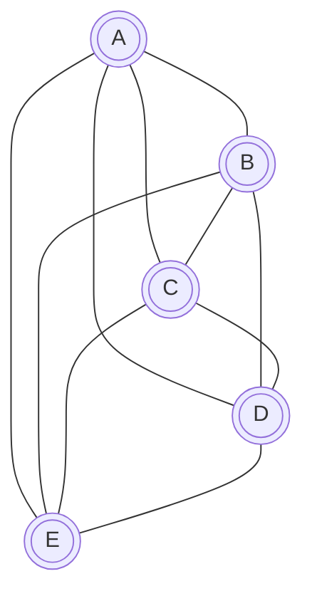
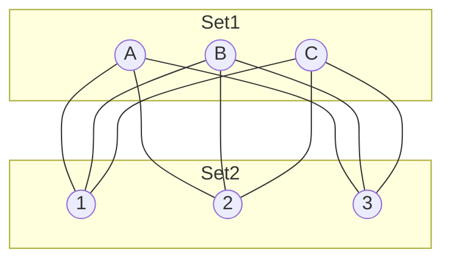
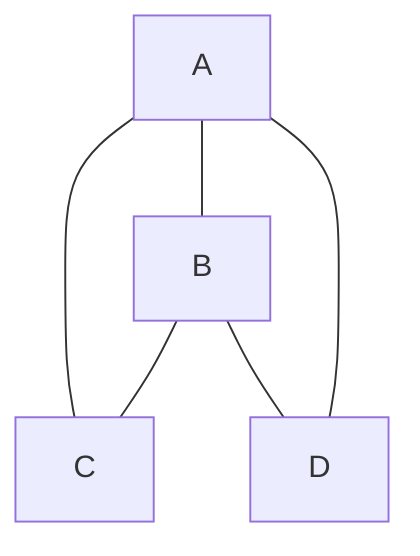

# Planarity

## Planar Graph
If we can draw a graph such that no two edges intersect each other (except at vertices), we call it a **Planar Graph**.
Drawing a planar graph on a plane without edge crossings is called a **Planar Embedding**.

### Key Non-Planar Graphs

#### $K_5$ (Kuratowski's First Graph)
$K_5$ is the complete graph on 5 vertices. It is the non-planar graph with the **minimum number of vertices**.

- Vertices ($n$): 5
- Edges ($e$): 10
- Degree of each vertex: 4 (Regular Graph)

> [!NOTE]
> $(K_5 - \text{one edge})$ is a planar graph.

#### $K_{3,3}$ (Kuratowski's Second Graph)
$K_{3,3}$ is the complete bipartite graph. It is the non-planar graph with the **minimum number of edges**.

- Vertices ($n$): 6
- Edges ($e$): 9
- Degree of each vertex: 3 (3-Regular Graph)

> [!NOTE]
> $(K_{3,3} - \text{one edge})$ is a planar graph.

---

## Regions (Faces)
When a planar graph is drawn on a plane, it divides the plane into regions (or faces).
- **Bounded/Finite Region**: Enclosed by edges.
- **Unbounded/Infinite Region**: The outer region surrounding the graph. There is always exactly **one** unbounded region.

### Euler's Formula
For a connected planar graph:
$$ n - e + f = 2 $$
Where:
- $n$: Number of vertices
- $e$: Number of edges
- $f$: Number of faces (regions)

> [!IMPORTANT]
> For **disconnected** graphs with $k$ components:
> $$ n - e + f = k + 1 $$

---

## Degree of Regions ($d(R_i)$)
The degree of a region is the number of edges bordering that region.
- If an edge is part of a cycle, it borders two different regions.
- If an edge is a bridge (cut-edge), it borders the same region twice (contributes 2 to the degree).

**Example:**
Consider a graph with a triangle $ABC$ inside a larger cycle.

(Hypothetical example for calculation logic)

**Summation Property:**
$$ \sum_{i=1}^{f} d(R_i) = 2e $$
**Reason:** Each edge contributes exactly 2 to the sum of degrees of regions (either bordering two different regions or the same region twice).

---

## Important Inequalities

### 1. General Planar Graphs ($e \le 3n - 6$)
Since each region is bounded by at least 3 edges (a triangle is the minimal closed region):
$$ d(R_i) \ge 3 $$
Summing for all $f$ regions:
$$ \sum d(R_i) \ge 3f $$
Using $\sum d(R_i) = 2e$:
$$ 2e \ge 3f \implies f \le \frac{2e}{3} $$
Substitute into Euler's formula ($n - e + f = 2$):
$$ n - e + \frac{2e}{3} \ge 2 $$
$$ n - \frac{e}{3} \ge 2 $$
$$ 3n - e \ge 6 $$
$$ e \le 3n - 6 $$

> [!TIP]
> **Contrapositive (Non-Planar Check):**
> If $e > 3n - 6$, then the graph is **Non-Planar**.
> Note: $e \le 3n-6$ is a necessary condition, not sufficient.

### 2. Triangle-Free Graphs ($e \le 2n - 4$)
If a graph has no triangles (e.g., Bipartite Graphs), then every region must be bounded by at least 4 edges (smallest cycle length is 4).
$$ d(R_i) \ge 4 $$
$$ \sum d(R_i) \ge 4f \implies 2e \ge 4f \implies f \le \frac{e}{2} $$
Substitute into Euler's formula:
$$ n - e + \frac{e}{2} \ge 2 $$
$$ n - \frac{e}{2} \ge 2 $$
$$ 2n - e \ge 4 $$
$$ 2n - 4 \ge e \quad \text{or} \quad e \le 2n - 4 $$

**Example Application:**
Check $K_{3,3}$ ($n=6, e=9$). It is bipartite (no triangles).
$$ \text{LHS} = e = 9 $$
$$ \text{RHS} = 2(6) - 4 = 8 $$
Since $9 \not\le 8$, $K_{3,3}$ is **Non-Planar**.

---

## Minimum Degree Theorem
**Theorem:** If $G$ is a connected planar graph, then $\delta(G) \le 5$ (Minimum degree is at most 5).

**Proof:**
We know sum of degrees $= 2e$.
$$ \sum_{v \in V} \text{deg}(v) = 2e $$
Also, $e \le 3n - 6$.
Average degree $= \frac{2e}{n} \le \frac{2(3n-6)}{n} = \frac{6n - 12}{n} = 6 - \frac{12}{n} < 6$.
Since the average degree is strictly less than 6, there must be at least one vertex with degree $\le 5$.

---

## Relevant PYQs

### GATE CSE 2014 Set 1
**Question:** Let $G$ be a connected planar graph with 10 vertices. If the number of edges on each face is three, then the number of edges in $G$ is ____.

**Solution:**
Here, every face is bounded by 3 edges, so $d(R_i) = 3$ for all $i$.
Sum of region degrees: $\sum d(R_i) = 3f$.
We know $\sum d(R_i) = 2e$.
So, $3f = 2e \implies f = \frac{2e}{3}$.
Using Euler's Formula:
$$ n - e + f = 2 $$
$$ 10 - e + \frac{2e}{3} = 2 $$
$$ 8 = e - \frac{2e}{3} = \frac{e}{3} $$
$$ e = 24 $$

---
