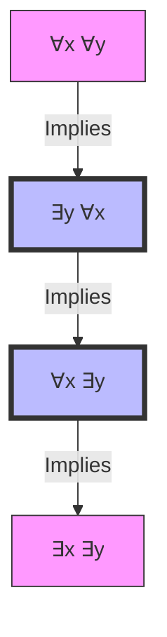

# Quantifiers: Nested & Implications

**Date**: 10/02/2026
**Tags**: #gate #dm #long #logic #predicate_logic #quantifiers
**YouTube Link**: [Lecture 8](https://www.youtube.com/watch?v=kA4Xpn_dse0&list=PL3eEXnCBViH9TTRzwOcwbXtUVK8-NHZrJ&index=8)

---

## 1. Important Equivalence & Implication Rules

We learned how quantifiers interact with logical connectives ($\land, \lor, \to$).

### 1.1 Strong Equivalences (Distributive)
These hold true in **both directions** ($\equiv$):
1.  **Universal over AND**: 
    $$ \forall x [ P(x) \land Q(x) ] \equiv \forall x P(x) \land \forall x Q(x) $$
    *Meaning*: "Everyone is smart AND kind" is the same as "Everyone is smart AND Everyone is kind".

2.  **Existential over OR**:
    $$ \exists x [ P(x) \lor Q(x) ] \equiv \exists x P(x) \lor \exists x Q(x) $$
    *Meaning*: "Someone is smart OR kind" is the same as "Someone is smart OR Someone is kind".

### 1.2 One-Way Implications
These hold true only in **one direction**:

1.  **Existential over AND**:
    $$ \exists x [ P(x) \land Q(x) ] \implies \exists x P(x) \land \exists x Q(x) $$
    *   **Logic**: If there is someone who is BOTH smart and kind, then definitely "Someone is smart" AND "Someone is kind".
    *   **Reverse is FALSE**: Just because someone is smart and someone (else) is kind, doesn't mean there is one person who is both.

2.  **Universal over OR**:
    $$ [ \forall x P(x) \lor \forall x Q(x) ] \implies \forall x [ P(x) \lor Q(x) ] $$
    *   **Logic**: If "Everyone is smart" OR "Everyone is kind", then definitely "Everyone is either smart or kind".
    *   **Reverse is FALSE**: "Everyone is either male or female" does NOT mean "Everyone is male OR Everyone is female".

3.  **Universal over Implication**:
    $$ \forall x [ P(x) \to Q(x) ] \implies [ (\forall x P(x)) \to (\forall x Q(x)) ] $$

4.  **Universal over Biconditional**:
    $$ \forall x [ P(x) \leftrightarrow Q(x) ] \implies [ (\forall x P(x)) \leftrightarrow (\forall x Q(x)) ] $$

---

## 2. Nested Quantifiers

When we have multiple quantifiers (e.g., $\forall x \exists y$), the **order matters** unless they are of the same type.

### 2.1 Same Quantifiers (Commutative)
*   $\forall x \forall y P(x, y) \equiv \forall y \forall x P(x, y)$
*   $\exists x \exists y P(x, y) \equiv \exists y \exists x P(x, y)$

### 2.2 Mixed Quantifiers (Non-Commutative)
Order changes the meaning entirety!

**Example Domain**: $D = \{1, 2, 3\}$
Statement: $x \cdot y \ge 0$ (assuming non-negative domain usually, but let's say $Z^+$).

1.  **$\forall x \forall y (x \cdot y \ge 0)$**: For all $x$, for all $y$, product is positive. (True if domain $Z^+$).
2.  **$\forall x \exists y (x + y = 10)$**: For every $x$, there corresponds some $y$. (True in Real numbers/Integers).
    *   *Interpretation*: $y$ can depend on $x$. If $x=1, y=9$. If $x=2, y=8$.
3.  **$\exists y \forall x (x + y = 10)$**: There is **one** specific $y$ that works for **all** $x$.
    *   *Interpretation*: Impossible in integers. If $y=5$, then $x+5=10$ only for $x=5$, not for all $x$. **FALSE**.

---

## 3. The Power Hierarchy (Most Important)

There is a strict hierarchy of strength among nested quantifiers.

$$ \forall x \forall y \implies \exists y \forall x \implies \forall x \exists y \implies \exists x \exists y $$

### Visualization of Mapping
*   **$\exists y \forall x$ (Stronger)**: There is a "Magic Key" $y$ that opens all locks $x$.
    *   One-to-All relationship.
*   **$\forall x \exists y$ (Weaker)**: Every lock $x$ has its own key $y$.
    *   All-to-Some relationship.

### Why $\exists y \forall x \implies \forall x \exists y$?
If there is one special person $y$ (say, a Chef) who cooks for **everyone** ($\forall x$), then it is automatically true that "Everyone ($\forall x$) has someone ($\exists y$) who cooks for them" (which happens to be that same Chef).

*   **LHS**: One $y$ for all $x$.
*   **RHS**: For each $x$, there is a $y$.

---

## 4. Relevant Questions

### Q1. Valid Formula Check
**Question**: Which of the following is valid?
1. $\forall x (P(x) \to Q(x)) \to (\forall x P(x) \to \forall x Q(x))$
2. $\exists x (P(x) \lor Q(x)) \to (\exists x P(x) \to \exists x Q(x))$

**Answer**: 
1. **Valid**. This matches our rule. If P implies Q for everyone, then if everyone is P, everyone must be Q.
2. **Invalid**.

### Q2. Convergent Sequence Logic (GATE)
The statement "The sequence converges to a limit" can be written as:
$$ \forall \epsilon > 0, \exists N, \forall n > N, |x_n - L| < \epsilon $$
Notice the alternating quantifiers $\forall \exists \forall$. Changing their order destroys the definition.

### Q3. Graph Theory Connection
*   $\forall x \exists y (x \text{ is connected to } y)$: Every node has at least one neighbor (No isolated vertices).
*   $\exists y \forall x (x \text{ is connected to } y)$: There is a "Master Node" connected to everyone (Star Graph center).

This clearly shows $\exists y \forall x \implies \forall x \exists y$ (A star center implies no isolated vertices), but not vice versa.
