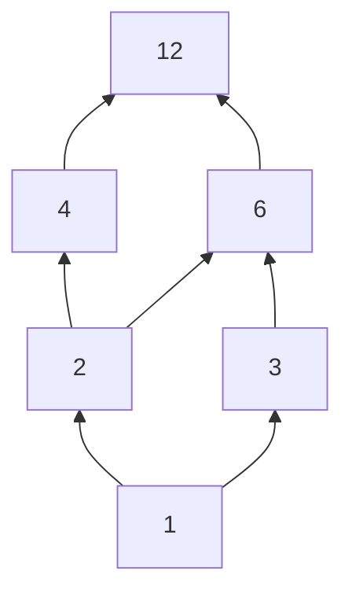

---
tags:
  - gate
  - dm
  - relations
  - equivalence_relation
  - long
---

# Relations, Equivalence, and Posets

## 1. Transitivity in Relations

A relation $R$ on a set $A$ is **transitive** if:
$$ \forall a, b, c \in A, ((a,b) \in R \land (b,c) \in R) \rightarrow (a,c) \in R $$

### Examples of Transitivity
- **Empty Relation** $R_1 = \emptyset$: Transitive (vacuously true).
- **Single Element** $R_2 = \{(1,1)\}$: Transitive.
- **Symmetric pairs without self-loops** $R_3 = \{(1,2), (2,1)\}$: **Not Transitive** (missing $(1,1)$ and $(2,2)$).
- **Incomplete Transitivity** $R_4 = \{(1,2), (2,1), (1,1)\}$: **Not Transitive** (missing $(2,2)$).
- **Complete Transitivity** $R_5 = \{(1,2), (2,1), (1,1), (2,2)\}$: Transitive.

### Why is $R_6 = \{(a,b) \mid a + b \le 3\}$ NOT Transitive?
Let's take a set of positive integers.
Suppose $a = 2$, $b = 1$, and $c = 2$.
- $(a,b) \in R_6 \implies (2,1)$ because $2 + 1 \le 3$ (True)
- $(b,c) \in R_6 \implies (1,2)$ because $1 + 2 \le 3$ (True)
- For $R_6$ to be transitive, $(a,c)$ must belong to $R_6$. $(a,c) = (2,2)$. But $2 + 2 = 4 \not\le 3$.
Hence, $R_6$ is **not transitive**.

---

## 2. Equivalence vs Partial Order Relation

A relation can be classified based on its properties.

| Feature | Equivalence Relation (RST) | Partial Order Relation (RAT) |
| :--- | :--- | :--- |
| **Definition** | A relation that is **R**eflexive, **S**ymmetric, and **T**ransitive. | A relation that is **R**eflexive, **A**nti-symmetric, and **T**ransitive. |
| **Symmetry Type** | **Symmetric**: $(a,b) \in R \implies (b,a) \in R$ | **Anti-Symmetric**: $(a,b) \in R \land (b,a) \in R \implies a=b$ |
| **Flipping** | Flipping of pairs is **allowed** (and required). | Flipping of pairs is **not allowed** (except for self-loops). |
| **Example** | Congruence modulo $k$: $R = \{(a,b) \mid a - b = 2k\}$ | Divisibility: $R = \{(a,b) \mid a \text{ divides } b\}$ on positive integers. |

---

## 3. Partially Ordered Sets (Posets)

A **Poset** is a combination of a set and a partial order relation acting on it, denoted as $(S, R)$.
Example: $(D_{12}, |)$ represents the divisors of 12 under the divisibility relation.

### Constructing a Hasse Diagram
Let $A = \{1, 2, 3, 4, 6, 12\}$ and Relation $R$ be divisibility (denoted by $|$):
$R = \{(1,1), (1,2), (1,3), (1,4), (1,6), (1,12), (2,2), (2,4), (2,6), (2,12), (3,3), (3,6), (3,12), (4,4), (4,12), (6,6), (6,12), (12,12)\}$

**Steps to create a Hasse Diagram:**
1. **Create a directed graph** using the relation values as edges.
2. **Remove self-loops** (since reflexivity is implied in a Poset).
3. **Remove transitive edges** (if $1 \rightarrow 2$ and $2 \rightarrow 4$, remove the $1 \rightarrow 4$ edge since it's implied).
4. **Draw direction bottom-up** (remove arrowheads).

#### Hasse Diagram for $(D_{12}, |)$:

*(Note: $(D_{24}, |)$ poset has 10 edges in its Hasse diagram).*

---

## 4. Bounds in a Poset

Given a poset $(A, R)$ and a subset $B \subseteq A$:

- **Greatest Element**: An element $x \in A$ such that for all $y \in A$, $(y, x) \in R$. ($x$ is the absolute top).
- **Least Element**: An element $x \in A$ such that for all $y \in A$, $(x, y) \in R$. ($x$ is the absolute bottom).

- **Upper Bound**: An element $x \in A$ is an upper bound for $B$ if every element in $B$ is related to $x$.
- **Lower Bound**: An element $x \in A$ is a lower bound for $B$ if $x$ is related to every element in $B$.

### Examples in $(D_{12}, |)$
Let $A = \{1, 2, 3, 4, 6, 12\}$:
- For $B = \{3, 4\}$:
  - **Upper Bounds**: 12 (since both 3 and 4 divide 12).
  - **Lower Bounds**: 1 (since 1 divides both 3 and 4).
- For $B = \{2, 6\}$:
  - **Upper Bounds**: 6 and 12 (both 2 and 6 divide 6, and both divide 12).
  - **Lower Bounds**: 1, 2 (both 1 and 2 divide 2, and both divide 6).

### Least Upper Bound (LUB) & Greatest Lower Bound (GLB)
- **Least Upper Bound (LUB) / Supremum**: The smallest of all upper bounds.
  - For $B = \{2, 6\}$, upper bounds are $\{6, 12\}$. The LUB is **6**.
- **Greatest Lower Bound (GLB) / Infimum**: The largest of all lower bounds.
  - For $B = \{2, 6\}$, lower bounds are $\{1, 2\}$. The GLB is **2**.

---

## 5. Lattices
In a poset, if **every pair** of elements has both a **GLB** and an **LUB**, then that poset is called a **Lattice**.
- The Hasse diagram of $(D_{12}, |)$ is a Lattice because any two elements have a unique LUB (LCM) and GLB (GCD).
