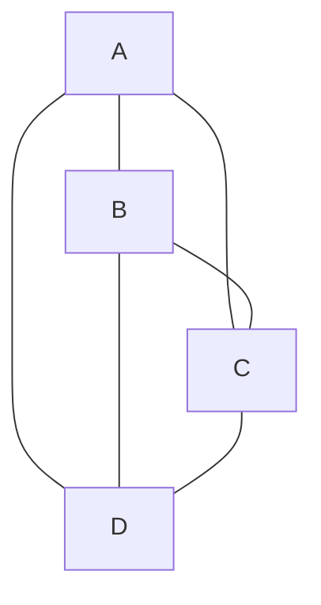
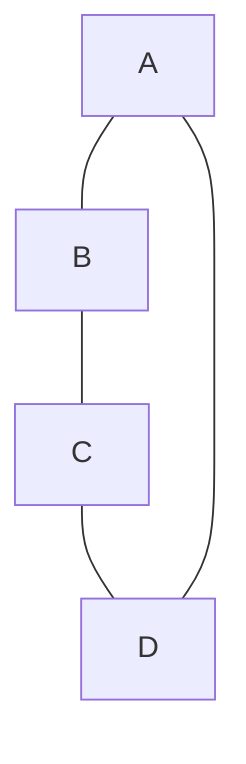
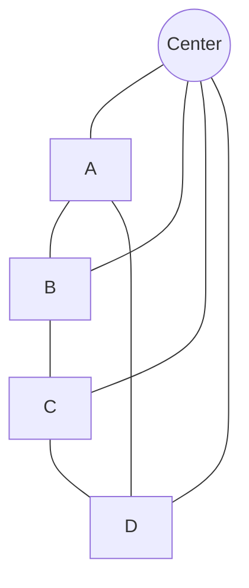
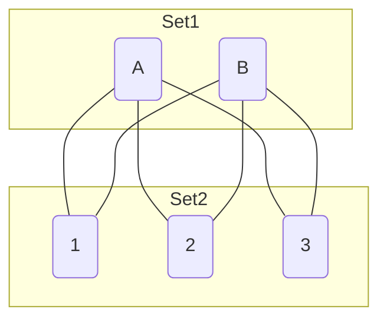

#gate #dm #short #graphs

# Graph Theory - Basics Summary (Hinglish)

**Date:** 27/01/2026

## 1. Graph Basics $G = (V, E)$
- **Vertex ($V$):** Point, Join.
- **Edge ($E$):** Line, Branch.
- **Degree ($d(v)$):** "Welding points". Ek vertex se kitni edges judi hain.

## 2. Important Theorems
1.  **Handshaking Lemma:**
    $$ \sum d(v_i) = 2 \times |E| $$
    *Matlab:* Sum of degrees hmesha **EVEN** hoga.
    
2.  **Odd Degree Vertices:**
    Total sum even hai, toh Odd degree wale vertices ka sum bhi even hona chahiye.
    *Conclusion:* **Number of odd degree vertices = EVEN count.**

3.  **Simple Graph Rules:**
    - No loops (khud se connection).
    - No parallel edges (multiple lines between same points).

4.  **Max Limits (Simple Graph):**
    - Max degree of a vertex: $n-1$
    - Max number of edges: $\frac{n(n-1)}{2}$

5.  **Average Degree:**
    $$ \frac{2|E|}{n} $$
    *Inequality:* Min Degree $\le$ Avg $\le$ Max Degree $\le n-1$

## 3. Havel-Hakimi Procedure (Check Graphical Sequence)
Agar check krna hai ki koi degree sequence valid simple graph bnata hai ya nahi:
1.  **Sort** descending (bada pehle).
2.  First element $k$ ko **remove** karo.
3.  Next $k$ elements me se **-1** karo.
4.  Wapis sort karo aur repeat karo.
5.  Agar end me sab **0** aa jaye -> **Graphical hai**.
6.  Agar negative aa jaye -> **Graphical nahi hai**.

## 4. Total Possible Graphs
Simple graph me har edge hone ya na hone ki probability hai.
Max edges $E_{max} = \frac{n(n-1)}{2}$ hote hain.
So, total graphs possible = $2^{E_{max}}$
$$ = 2^{\frac{n(n-1)}{2}} $$

---
## 5. Special Types of Graphs

### 1. Complete Graph ($K_n$) ($n \ge 1$)
- **Definition:** Har vertex har dusre vertex se directly connected hota hai.
- **Degree:** Each vertex has degree $n-1$.
- **Edges:** $|E| = \frac{n(n-1)}{2}$
- **Example ($K_4$):**

### 2. Regular Graph
- **Definition:** Har vertex ki degree same hoti hai ($k$-Regular).
- **Condition:** $\delta(G) = \text{Avg Degree} = \Delta(G) = k$
- **Formula:** $k = \frac{2|E|}{n}$
- **Example:** $K_n$ is $(n-1)$-regular. $C_n$ is 2-regular.

### 3. Cycle Graph ($C_n$) ($n \ge 3$)
- **Definition:** Closed loop.
- **Degree:** Har vertex ki degree 2 hoti hai.
- **Edges:** $|E| = |V| = n$
- **Note:** All $C_n$ are regular graphs, but not all 2-regular graphs are $C_n$ (disconnected cycles possible).
- **Example ($C_4$):**

### 4. Wheel Graph ($W_n$) ($n \ge 4$)
- **Construction:** Take a Cycle Graph $C_{n-1}$ (rim) and add a central hub vertex connected to all rim vertices.
- **Edges:** $(n-1)$ from cycle + $(n-1)$ spokes = $2(n-1)$
- **Degree:**
    - Hub vertex: $n-1$
    - Rim vertices: 3
- **Theorem:** $3(n-1) + (n-1) = 2 \times 2(n-1)$ (Handshaking verified)
- **Example ($W_5$):** (Derived from $C_4$ + Center)

### 5. Bipartite Graph
- **Definition:** Vertices ko 2 sets ($V_1, V_2$) me divide kr skte hain jahan edges sirf $V_1$ se $V_2$ ke beech hoti hain (same set me nahi).
- **Property:** **No odd length cycles.**
- **Complete Bipartite ($K_{m,n}$):**
    - $V_1$ has $m$ vertices, $V_2$ has $n$.
    - Total Vertices: $m + n$
    - Total Edges: $m \times n$
- **Example ($K_{2,3}$):**

### 6. Hypercube ($Q_n$) ($n \ge 1$)
- **Vertices:** Represented as $n$-bit strings. Total vertices $2^n$.
- **Edges:** Connect vertices that differ by exactly 1 bit.
- **Degree:** Each vertex has degree $n$ ($n$-Regular).
- **Total Edges:** $\frac{n \times 2^n}{2} = n 2^{n-1}$
- **Note:** Every hypercube is a Bipartite Graph.

### 7. Complement Graph ($\bar{G}$ or $G'$)
- **Definition:** Edges jo $G$ me hain wo $\bar{G}$ me nahi hongi, aur vice versa.
- **Property:** $G + \bar{G} = K_n$ (Complete Graph)
- **Edges:** $|E(G)| + |E(\bar{G})| = \frac{n(n-1)}{2}$

### 8. Self-Complement Graph
- **Definition:** $G \cong \bar{G}$ (Graph is isomorphic to its complement).
- **Formula:** Since $|E(G)| = |E(\bar{G})|$:
    $$ 2|E| = \frac{n(n-1)}{2} \implies |E| = \frac{n(n-1)}{4} $$
- **Condition:** $n(n-1)$ must be divisible by 4 (i.e., $n \equiv 0 \pmod 4$ or $n \equiv 1 \pmod 4$).

### 9. Line Graph $L(G)$
- **Definition:** Edges of $G$ become Vertices of $L(G)$. Connect them if original edges shared a common vertex.

---
## Relevant PYQs

### GATE CSE 2010 | Question: 28
[Discussion Link](https://gateoverflow.in/1154/gate-cse-2010-question-28)

The degree sequence of a simple graph is the sequence of the degrees of the nodes in the graph in decreasing order. Which of the following sequences can not be the degree sequence of any graph?

<ol style="list-style-type:upper-roman">
<li>$7, 6, 5, 4, 4, 3, 2, 1$</li>
<li>$6, 6, 6, 6, 3, 3, 2, 2$</li>
<li>$7, 6, 6, 4, 4, 3, 2, 2$</li>
<li>$8, 7, 7, 6, 4, 2, 1, 1$</li>
</ol>
<ol style="list-style-type:upper-alpha">
<li>I and II</li>
<li>III and IV</li>
<li>IV only</li>
<li>II and IV</li>
</ol>

---

### GATE CSE 2022 | Question: 20
[Discussion Link](https://gateoverflow.in/371916/gate-cse-2022-question-20)

Consider a simple undirected graph of $10$ vertices. If the graph is disconnected, then the maximum number of edges it can have is _______________ .

---

### GATE CSE 2016 Set 1 | Question: 40
[Discussion Link](https://gateoverflow.in/39727/gate-cse-2016-set-1-question-40)

$G=(V, E)$ is an undirected simple graph in which each edge has a distinct weight, and $e$ is a particular edge of $G$. Which of the following statements about the minimum spanning trees $(MSTs)$ of $G$ is/are TRUE?

<ol style="list-style-type: upper-roman;">
<li>If $e$ is the lightest edge of some cycle in $G$, then every MST of $G$ includes $e$.</li>
<li>If $e$ is the heaviest edge of some cycle in $G$, then every MST of $G$ excludes $e$.</li>
</ol>
<ol style="list-style-type:upper-alpha">
<li>I only.</li>
<li>II only.</li>
<li>Both I and II.</li>
<li>Neither I nor II.</li>
</ol>

---
