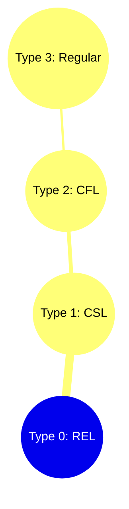

---
tags:
  - #toc
  - #long
  - #gate
  - #automata
  - #grammar
---

# Basics of Theory of Computation & Chomsky Hierarchy

## 1. Core Definitions

- **Grammar**: A set of productions or rules that generate strings in a language.
- **Machine / Automata**: Represents a language. It evaluates strings to determine if they belong to a language.
- **Language**: A set of strings.

---

## 2. Fundamental Concepts

### Symbol
A symbol is anything of length 1. It is the smallest unit of a language. We can decide on anything to be a symbol.

### Alphabet
An alphabet is a finite set of symbols (1-length strings). A symbol belongs to an alphabet.
Common alphabets include:
- **Input Alphabet** ($\Sigma$)
- **Output Alphabet** ($\Delta$)
- **Stack Alphabet** ($\Gamma$)
- **Tape Alphabet**

### String
A string is a finite sequence of symbols defined over an alphabet ($\Sigma$). It is an ordered set.
- The number of $k$-length strings where $n = |\Sigma|$ (length of the alphabet set) is $n^k$.

---

## 3. Operations on Strings
Consider $\Sigma = \{a, b\}$ or $\{a, b, c\}$ for the following examples:

1. **Length of a String**: Denoted by $|w|$.
   - $w = abb \implies |w| = 3$
   - $w = \epsilon \implies |w| = 0$

2. **Concatenation of 2 Strings**:
   - $w_1 = ab$, $w_2 = \epsilon \implies w_1w_2 = ab$, $w_2w1 = ab$
   - $w_1 = aa$, $w_2 = ab \implies w_1w_2 = aaab$, $w_2w_1 = abaa$
   - $|w_1| = m, |w_2| = n \implies |w_1w_2| = m + n$

3. **Reversal of a String**: Denoted by $w^R$.
   - $w = aab \implies w^R = baa$
   - $|w^R| = |w|$
   - *Note*: If there is only one symbol in an alphabet, then $w = w^R$ always.

4. **Prefix of a String**:
   - $w = abc$
   - Prefixes of $w = \{\epsilon, a, ab, abc\}$
   - Number of prefixes $= |w| + 1$

5. **Suffix of a String**:
   - $w = abc$
   - Suffixes of $w = \{\epsilon, c, bc, abc\}$
   - Number of suffixes $= |w| + 1$

6. **Substring of a String**:
   - $w = abc$
   - Substrings $= \{\epsilon, a, b, c, ab, bc, abc\}$
   - Max number of substrings $= \frac{|w|^2 + |w|}{2} + 1$
   - Min number of substrings $= |w| + 1$

---

## 4. Languages
A **Language** is a set of strings.
- How many strings can be formed over $\Sigma$? Infinite.
- A problem is represented as a language. It is either formal or not formal.
- In formal problems, they are represented by RELs or not RELs.

### Types of Languages
We can make a lot of combinations, including:
- Finite sets
- Infinite sets
- Regular sets
- DCFLs (Deterministic Context-Free Languages)
- CFLs (Context-Free Languages)
- CSLs (Context-Sensitive Languages)
- Recursive languages (Decidable Sets)
- Recursively Enumerable sets (RELs)
- Non-recursive sets (Undecidable sets)

---

## 5. Machines
Automata or machines represent languages and are used to accept or reject sets of strings:
- **Finite Automata (FA)**: Represents regular language. Regular problems require only $O(1)$ memory/space. FA can be DFA, NFA, or FA with output (Moore, Mealy).
- **Deterministic Push Down Automata (DPDA)**
- **Push Down Automata (PDA)**
- **Linear Bound Automata (LBA)**
- **Halting Turing Machine (HTM)**
- **Turing Machine (TM)**

*Note*: A regular set is accepted by **ALL** machines.

---

## 6. Grammars
Different types of restrictions on production rules give rise to different grammars:
- Regular Grammar
- Linear Grammar
- CFG (Context-Free Grammar)
- CSG (Context-Sensitive Grammar)
- UG (Unrestricted Grammar)

---

## 7. Chomsky Hierarchy
The Chomsky hierarchy represents the containment of classes of formal languages.

Classes in Chomsky hierarchy:
**Regular Language $\subset$ DCFL $\subset$ CFL $\subset$ CSL $\subset$ Recursive $\subset$ REL**

### Hierarchy Diagram

*(Conceptually, Type 3 is a subset of Type 2, which is a subset of Type 1, which is a subset of Type 0).*

---
## Relevant PYQs

### GATE CSE 2017 Set 2 | Question: 41
[Discussion Link](https://gateoverflow.in/118605/gate-cse-2017-set-2-question-41)

Let $L(R)$ be the language represented by regular expression $R$. Let $L(G)$ be the language generated by a context free grammar $G$. Let $L(M)$ be the language accepted by a Turing machine $M$. Which of the following decision problems are undecidable?

<ol style="list-style-type:upper-roman">
<li>Given a regular expression $R$ and a string $w$, is $w \in L(R)$?</li>
<li>Given a context-free grammar $G$, is $L(G)  = \emptyset$</li>
<li>Given a context-free grammar $G$, is $L(G)  = \Sigma^*$ for some alphabet $\Sigma$?</li>
<li>Given a Turing machine $M$ and a string $w$, is $w \in L(M)$?</li>
</ol>
<ol style="list-style-type:upper-alpha">
<li>I and IV only</li>
<li>II and III only</li>
<li>II, III and IV only</li>
<li>III and IV only</li>
</ol>

---

### GATE CSE 2011 | Question: 8
[Discussion Link](https://gateoverflow.in/2110/gate-cse-2011-question-8)

Which of the following pairs have <strong>DIFFERENT </strong>expressive power?

<ol style="list-style-type: upper-alpha;">
<li>Deterministic finite automata (DFA) and Non-deterministic finite automata (NFA)</li>
<li>Deterministic push down automata (DPDA) and Non-deterministic push down automata (NPDA)</li>
<li>Deterministic single tape Turing machine and Non-deterministic single tape Turing machine</li>
<li>Single tape Turing machine and multi-tape Turing machine</li>
</ol>

---

### GATE CSE 2011 | Question: 26
[Discussion Link](https://gateoverflow.in/2128/gate-cse-2011-question-26)

Consider the languages $L1, \:L2 \:and \: L3$ as given below.

$L1=\{0^p 1^q \mid p, q \in N\}, \\ L2 = \{0^p 1^q \mid p, q \in N \:and \:p=q\} \: and \\ L3 = \{0^p 1^q 0^r \mid p, q, r \in N\: and \: p=q=r\}.$ 

Which of the following statements is <strong>NOT TRUE</strong>?

<ol style="list-style-type: upper-alpha;">
<li>Push Down Automata (PDA) can be used to recognize $L1$ and $L2$</li>
<li>$L1$ is a regular language</li>
<li>All the three languages are context free</li>
<li>Turing machines can be used to recognize all the languages</li>
</ol>

---

### GATE CSE 2002 | Question: 2.18
[Discussion Link](https://gateoverflow.in/848/gate-cse-2002-question-2-18)

The C language is:

<ol style="list-style-type:upper-alpha">
<li>A context free language</li>
<li>A context sensitive language</li>
<li>A regular language</li>
<li>Parsable fully only by a Turing machine</li>
</ol>

---

### GATE IT 2007 | Question: 71
[Discussion Link](https://gateoverflow.in/3523/gate-it-2007-question-71)

Consider the regular expression $R = (a + b)^* (aa + bb) (a + b)^*$

Which of the following non-deterministic finite automata recognizes the language defined by the regular expression $R$? Edges labeled $\lambda $ denote transitions on the empty string.

<ol class="shrink-inline-options2" style="list-style-type:upper-alpha">
<li> 
</li>
<li> 
</li>
<li> 
</li>
<li> 
</li>
</ol>

---
