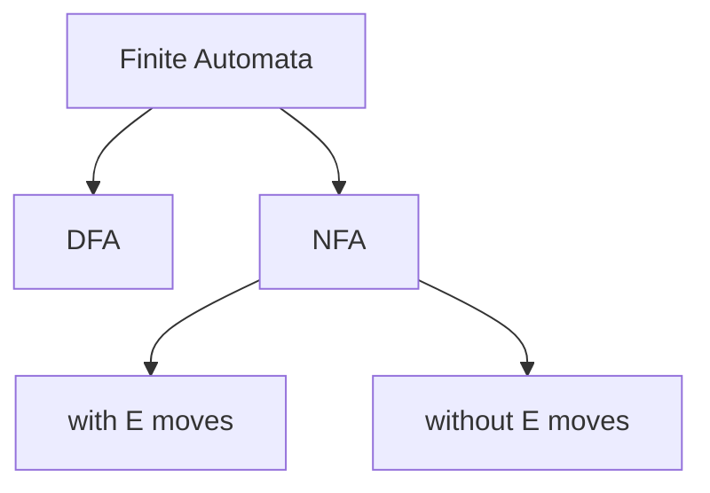
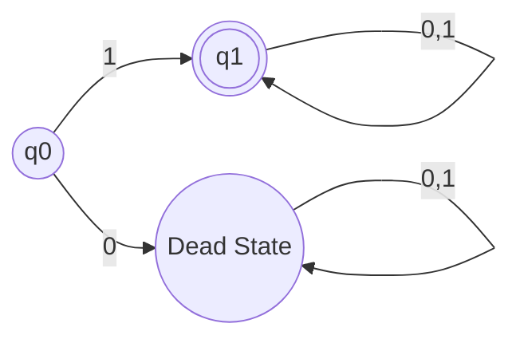
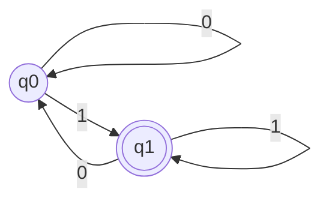
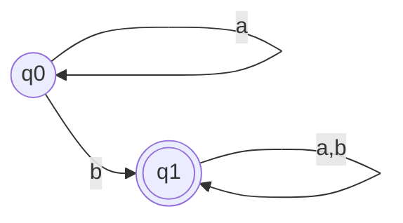
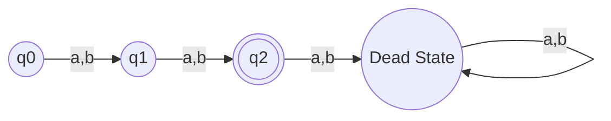
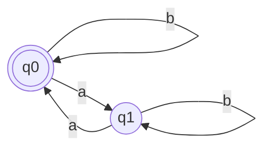

# Finite Automata & DFA

**Tags:** #gate #toc #automata #dfa #nfa #long

## Introduction to Finite Automata (FA)
A Finite Automaton represents a regular set. It acts as an acceptor or recognizer for strings.

### Mathematical Model
A Finite Automaton is defined as a 5-tuple:
$FA = (Q, \Sigma, \delta, q_0, F)$
Where:
- $\Sigma$ = Input alphabets
- $Q$ = Set of states
- $q_0$ = Initial state
- $F$ = Set of final states
- $\delta$ = Transition function

### Working Mechanism
$$ \text{Input } (W) \longrightarrow \text{FA (Acceptor/Recognizer)} $$
- If $W$ belongs to $L$ (valid strings), the FA halts at a final state.
- If $W$ does not belong to $L$ (invalid strings), the FA halts at a non-final state.
- **Important:** FA always halts.

> [!NOTE]
> DFA and NFA are equivalent in computational power. Both can recognize Regular Languages.

---

## Deterministic Finite Automata (DFA)

In a DFA, for a given state and input symbol, there is exactly one next state.

### Transition Function
$\delta: Q \times \Sigma \to Q$
From every state in $Q$, for every input symbol in $\Sigma$, there is exactly one transition to the next state in $Q$.

### Key Properties
1. **$\Sigma^*$ Language:** If every state is a final state in a DFA, then the language accepted is $\Sigma^*$.
2. **Empty Language ($\emptyset$):** If every state is non-final in a DFA, then the language accepted is $\emptyset$.
3. **Dead State:** A state from which there is no path to a final state.
4. **Uniqueness:** Every regular language is accepted by only one unique minimal DFA.

### DFA Examples
#### 1. Set of all binary strings starting with 1
$L = \{1, 10, 11, 100, \dots\}$

#### 2. Set of all binary strings ending with 1
$L = \{1, 01, 11, 001, \dots\}$

#### 3. Set of strings containing 'b' over $\Sigma = \{a,b\}$

#### 4. Set of 2 length strings over $\Sigma = \{a,b\}$

#### 5. Strings with an even number of a's over $\Sigma = \{a,b\}$

---
## Relevant PYQs

### GATE CSE 2011 | Question: 8
[Discussion Link](https://gateoverflow.in/2110/gate-cse-2011-question-8)

Which of the following pairs have <strong>DIFFERENT </strong>expressive power?

<ol style="list-style-type: upper-alpha;">
<li>Deterministic finite automata (DFA) and Non-deterministic finite automata (NFA)</li>
<li>Deterministic push down automata (DPDA) and Non-deterministic push down automata (NPDA)</li>
<li>Deterministic single tape Turing machine and Non-deterministic single tape Turing machine</li>
<li>Single tape Turing machine and multi-tape Turing machine</li>
</ol>

---

### GATE IT 2008 | Question: 6
[Discussion Link](https://gateoverflow.in/3266/gate-it-2008-question-6)

Let $N$ be an NFA with $n$ states and let $M$ be the minimized DFA with m states recogniz­ing the same language. Which of the following in NECESSARILY true?

<ol style="list-style-type:upper-alpha">
<li>$m \leq 2^n$</li>
<li>$n \leq m$</li>
<li>$M$ has one accept state</li>
<li>$m = 2^n$</li>
</ol>

---

### GATE CSE 2018 | Question: 6
[Discussion Link](https://gateoverflow.in/204080/gate-cse-2018-question-6)

Let $N$ be an NFA with $n$ states. Let $k$ be the number of states of a minimal DFA which is equivalent to $N$. Which one of the following is necessarily true?

<ol style="list-style-type:upper-alpha">
<li>$k \geq 2^n$</li>
<li>$k \geq n$</li>
<li>$k \leq n^2$</li>
<li>$k \leq 2^n$</li>
</ol>

---

### GATE CSE 2013 | Question: 41
[Discussion Link](https://gateoverflow.in/1553/gate-cse-2013-question-41)

Which of the following is/are undecidable?

<ol>
<li>$G$ is a CFG. Is $L(G) = \phi$?</li>
<li>$G$ is a CFG. Is $L(G) = \Sigma^*$?</li>
<li>$M$ is a Turing machine. Is $L(M)$ regular?</li>
<li>$A$ is a DFA and $N$ is an NFA. Is $L(A) = L(N)$?</li>
</ol>
<ol style="list-style-type:upper-alpha">
<li>$3$ only      </li>
<li>$3$ and $4$ only      </li>
<li>$1, 2$ and $3$ only      </li>
<li>$2$ and $3$ only</li>
</ol>

---

### GATE CSE 2009 | Question: 16, ISRO2017-12
[Discussion Link](https://gateoverflow.in/1308/gate-cse-2009-question-16-isro2017-12)

Which one of the following is FALSE?

<ol style="list-style-type:upper-alpha">
<li>

There is a unique minimal DFA for every regular language

</li>
<li>

Every NFA can be converted to an equivalent PDA.

</li>
<li>

Complement of every context-free language is recursive.

</li>
<li>

Every nondeterministic PDA can be converted to an equivalent deterministic PDA.

</li>
</ol>

---
