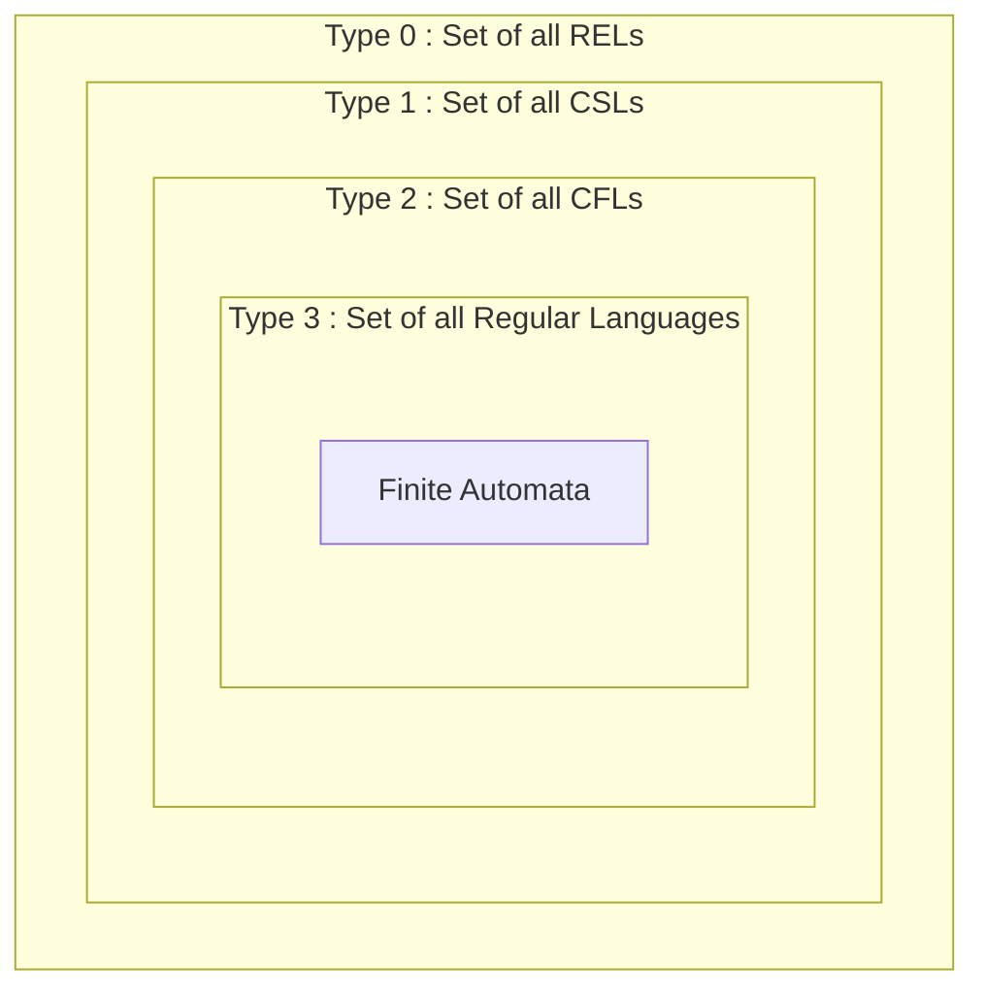

---
tags:
  - #toc
  - #short
  - #gate
  - #automata
---

# TOC Basics & Chomsky Hierarchy (Short Notes)

## 1. Quick Definitions
- **Grammar**: Production rules ka set ($S \rightarrow aSb$).
- **Machine**: Represents a language (accept/reject karta hai strings ko).
- **Language**: Set of strings.

## 2. Symbols, Alphabets, Strings
- **Symbol**: Smallest unit, length 1.
- **Alphabet ($\Sigma$, $\Gamma$, $\Delta$)**: Finite set of symbols.
- **String**: Finite sequence defined over $\Sigma$. $n = |\Sigma|$ then $n^k$ total $k$-length strings possible.

## 3. String Operations
Agar $|w| = n$:
- **Length**: Number of symbols in string.
- **Concat**: $|w_1w_2| = |w_1| + |w_2|$.
- **Reversal**: $w^R$. Agar alphabet mein ek hi symbol hai to $w = w^R$.
- **Prefix / Suffix**: Dono count hoti hain $|w| + 1$.
- **Substrings**:
  - Max $= \frac{|w|^2 + |w|}{2} + 1$
  - Min $= |w| + 1$

## 4. Languages & Machines
- **Regular Problems**: Jo $O(1)$ memory/space mein solve ho jayein. Accepted by **ALL** machines. FA (DFA/NFA) inko represent karta hai.
- **Machines Order**: FA $\rightarrow$ DPDA $\rightarrow$ PDA $\rightarrow$ LBA $\rightarrow$ HTM $\rightarrow$ TM.

## 5. Chomsky Hierarchy
Ye subset relation yaad rakhna:
**Regular Language $\subset$ DCFL $\subset$ CFL $\subset$ CSL $\subset$ Recursive $\subset$ REL**

| Grammar | Type | Accepted By | Language |
|---|---|---|---|
| Regular | Type 3 | Finite Automaton (FA) | Regular Languages |
| Context-Free (CFG) | Type 2 | Pushdown Automaton (PDA) | CFL |
| Context-Sensitive (CSG) | Type 1 | Linear Bounded Automaton (LBA) | CSL |
| Unrestricted (UG) | Type 0 | Turing Machine (TM) | REL |

### Venn Diagram Intuition

---
## Relevant PYQs

### GATE CSE 2017 Set 2 | Question: 41
[Discussion Link](https://gateoverflow.in/118605/gate-cse-2017-set-2-question-41)

Let $L(R)$ be the language represented by regular expression $R$. Let $L(G)$ be the language generated by a context free grammar $G$. Let $L(M)$ be the language accepted by a Turing machine $M$. Which of the following decision problems are undecidable?

<ol style="list-style-type:upper-roman">
<li>Given a regular expression $R$ and a string $w$, is $w \in L(R)$?</li>
<li>Given a context-free grammar $G$, is $L(G)  = \emptyset$</li>
<li>Given a context-free grammar $G$, is $L(G)  = \Sigma^*$ for some alphabet $\Sigma$?</li>
<li>Given a Turing machine $M$ and a string $w$, is $w \in L(M)$?</li>
</ol>
<ol style="list-style-type:upper-alpha">
<li>I and IV only</li>
<li>II and III only</li>
<li>II, III and IV only</li>
<li>III and IV only</li>
</ol>

---

### GATE CSE 2011 | Question: 8
[Discussion Link](https://gateoverflow.in/2110/gate-cse-2011-question-8)

Which of the following pairs have <strong>DIFFERENT </strong>expressive power?

<ol style="list-style-type: upper-alpha;">
<li>Deterministic finite automata (DFA) and Non-deterministic finite automata (NFA)</li>
<li>Deterministic push down automata (DPDA) and Non-deterministic push down automata (NPDA)</li>
<li>Deterministic single tape Turing machine and Non-deterministic single tape Turing machine</li>
<li>Single tape Turing machine and multi-tape Turing machine</li>
</ol>

---

### GATE CSE 2011 | Question: 26
[Discussion Link](https://gateoverflow.in/2128/gate-cse-2011-question-26)

Consider the languages $L1, \:L2 \:and \: L3$ as given below.

$L1=\{0^p 1^q \mid p, q \in N\}, \\ L2 = \{0^p 1^q \mid p, q \in N \:and \:p=q\} \: and \\ L3 = \{0^p 1^q 0^r \mid p, q, r \in N\: and \: p=q=r\}.$ 

Which of the following statements is <strong>NOT TRUE</strong>?

<ol style="list-style-type: upper-alpha;">
<li>Push Down Automata (PDA) can be used to recognize $L1$ and $L2$</li>
<li>$L1$ is a regular language</li>
<li>All the three languages are context free</li>
<li>Turing machines can be used to recognize all the languages</li>
</ol>

---

### GATE CSE 2002 | Question: 2.18
[Discussion Link](https://gateoverflow.in/848/gate-cse-2002-question-2-18)

The C language is:

<ol style="list-style-type:upper-alpha">
<li>A context free language</li>
<li>A context sensitive language</li>
<li>A regular language</li>
<li>Parsable fully only by a Turing machine</li>
</ol>

---

### GATE IT 2007 | Question: 71
[Discussion Link](https://gateoverflow.in/3523/gate-it-2007-question-71)

Consider the regular expression $R = (a + b)^* (aa + bb) (a + b)^*$

Which of the following non-deterministic finite automata recognizes the language defined by the regular expression $R$? Edges labeled $\lambda $ denote transitions on the empty string.

<ol class="shrink-inline-options2" style="list-style-type:upper-alpha">
<li> 
</li>
<li> 
</li>
<li> 
</li>
<li> 
</li>
</ol>

---
